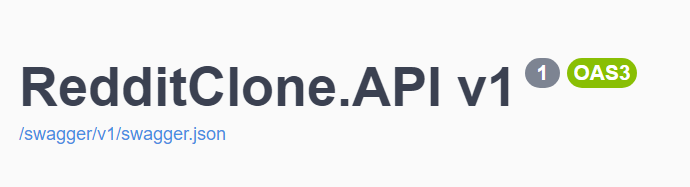

<a name="readme-top"></a>

[![Contributors][contributors-shield]][contributors-url]
[![Forks][forks-shield]][forks-url]
[![Stargazers][stars-shield]][stars-url]
[![Issues][issues-shield]][issues-url]
[![MIT License][license-shield]][license-url]
[![LinkedIn][linkedin-shield]][linkedin-url]
<!-- PROJECT LOGO -->
<br />
<div align="center">


<h3 align="center">Reddit Clone API</h3>

  <p align="center">
    This project is a Minimal API using Clean Code, Solid, Outbox, DDD, CQRS, REPR and Event driven.
  </p>
</div>
<!-- TABLE OF CONTENTS -->
<details>
  <summary>Table of Contents</summary>
  <ol>
    <li>
      <a href="#about-the-project">About The Project</a>
      <ul>
        <li><a href="#built-with">Built With</a></li>
      </ul>
    </li>
    <li>
      <a href="#getting-started">Getting Started</a>
      <ul>
        <li><a href="#prerequisites">Prerequisites</a></li>
        <li><a href="#installation">Installation</a></li>
        <li><a href="#references">References</a></li>
      </ul>
    </li>
    <li>
      <a href="#contact">Contact</a>
    </li>
  </ol>
</details>

## About The Project

I made a Reddit clone as a personal learning project, driven by my determination to improve my skills and familiarize myself with the most in-demand technologies in the market. By challenging myself in this way I was able to greatly improve my software architecture skills, which allows me to better see solutions as a whole and become better every day.

<p align="right">(<a href="#readme-top">back to top</a>)</p>

### Built With
* [![C#][C#img]][C#-url]
* <a href="https://dotnet.microsoft.com/en-us/download/dotnet"></a>
* <a href="https://www.nuget.org/packages/Microsoft.EntityFrameworkCore"></a>
* <a href="https://www.postgresql.org/"></a>
* <a href="https://www.nuget.org/packages/MediatR"></a>
* <a href="https://docs.fluentvalidation.net/en/latest/index.html"></a>
* <a href="https://www.nuget.org/packages/Quartz"></a>
* <a href="https://serilog.net/"></a>
* <a href="https://testcontainers.com/"></a>
* <a href="https://xunit.net/">Xunit</a>
* <a href="https://www.rabbitmq.com/">RabbitMq</a>
* <a href="https://www.nuget.org/packages/Rebus">Rebus</a>
* <a href="https://www.nuget.org/packages/ErrorOr/">ErrorOr</a>

<p align="right">(<a href="#readme-top">back to top</a>)</p>

## Getting Started

### Pré Requisites

* First of all you will need download and install [Docker][Docker-Url]

* See the guide to install Docker Desktop on Windows [here][Docker-Guide]

* Personally recommend use the WSL 2 setup since not tested yet with hyper-v

### Installation

* Clone repository
```
  https://github.com/MarcoAntunes37/RedditClone.git
```

* Open cloned repository folder
```
  cd RedditClone.API
```
* Open appsettings.json or appsettings.Development.json depending of what type of env.

* You will need to configure a secret to create JWT Token, it need to be a string with at least 128bits.

* To use email recovery you will need to configure a smtp server.

* Start docker compose container
```
  cd RedditClone; docker compose -up
```

* If all credentials are correct docker will start the API listened in:
```
  http://localhost:8080
```

* You can access api documentation in url
```
  http://localhost:8080/swagger
```

## Known problems

* I tried to do an integration test, it normally integrates with the database container but I can't make it integrate with the other containers, it shows as if the container wasn't available yet. I'm using the Testcontainers library.

## Contact

Marco Antunes - marcoantunesdev@gmail.com

Project Link: [https://github.com/MarcoAntunes37/RedditClone](https://github.com/MarcoAntunes37/RedditClone)

<p align="right">(<a href="#readme-top">back to top</a>)</p>


<!-- MARKDOWN LINKS & IMAGES -->
<!-- https://www.markdownguide.org/basic-syntax/#reference-style-links -->
[contributors-shield]: https://img.shields.io/github/contributors/MarcoAntunes37/RedditClone.svg?style=for-the-badge
[contributors-url]: https://github.com/MarcoAntunes37/RedditClone/graphs/contributors
[forks-shield]: https://img.shields.io/github/forks/MarcoAntunes37/RedditClone.svg?style=for-the-badge
[forks-url]: https://github.com/MarcoAntunes37/RedditClone/network/members
[stars-shield]: https://img.shields.io/github/stars/MarcoAntunes37/RedditClone.svg?style=for-the-badge
[stars-url]: https://github.com/MarcoAntunes37/RedditClone/stargazers
[issues-shield]: https://img.shields.io/github/issues/MarcoAntunes37/RedditClone.svg?style=for-the-badge
[issues-url]: https://github.com/MarcoAntunes37/RedditClone/issues
[license-shield]: https://img.shields.io/github/license/MarcoAntunes37/RedditClone.svg?style=for-the-badge
[license-url]: https://github.com/MarcoAntunes37/RedditClone/blob/master/LICENSE.txt
[linkedin-shield]: https://img.shields.io/badge/-LinkedIn-black.svg?style=for-the-badge&logo=linkedin&colorB=555
[linkedin-url]: https://linkedin.com/in/marco-aurelio-antunes-junior-0b11526a/
[product-screenshot]: images/screenshot.png
[C#img]: https://img.shields.io/badge/c%23-%23239120.svg?style=for-the-badge&logo=c-sharp&logoColor=white
[DotnetUrl]: https://dotnet.microsoft.com/en-us/download/dotnet
[C#-url]: https://learn.microsoft.com/en-us/dotnet/csharp/
[Docker-Url]: https://www.docker.com/products/docker-desktop/
[Docker-Guide]: https://docs.docker.com/desktop/install/windows-install/